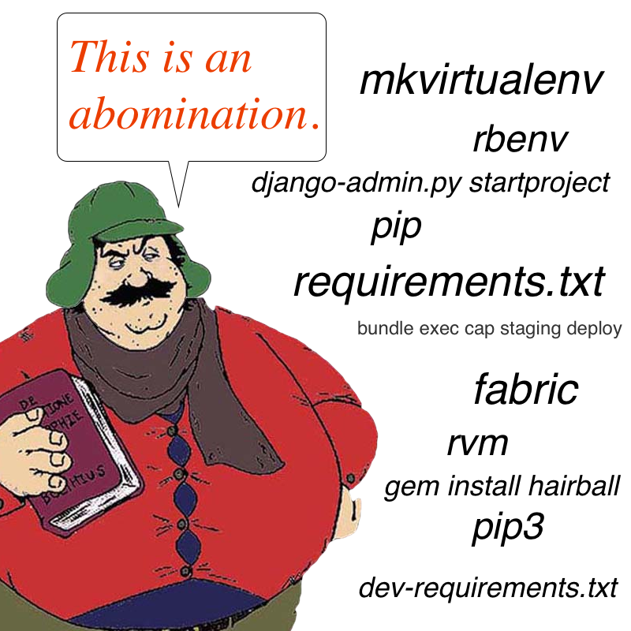
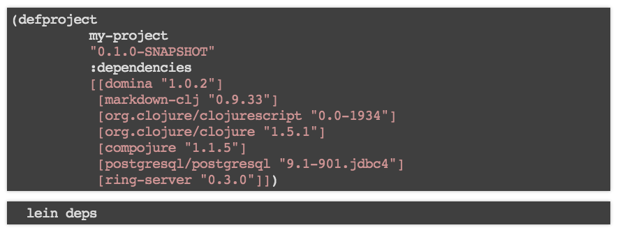
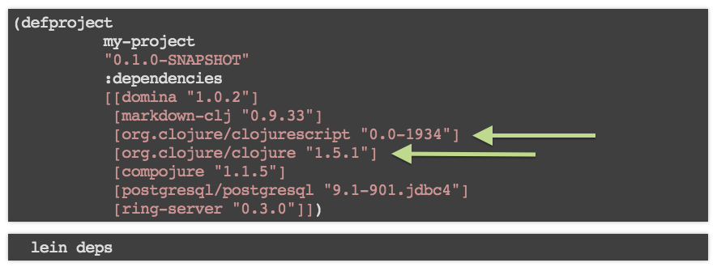

% C̶l̶o̶j̶u̶r̶e̶ Leiningen in 5 minutes 
% Kit Randel (@blrandel)
% CodeCraft Dunedin Lightning Talks - December 2013


# Clojure

## is a joy 


# Clojure

## Powerful and *Simple* 
* Runs on the JVM and in the browser
* First class support for web programming with ClojureScript
* Polymorphic functions over datatypes and colls
* Immutability
* Macros
* Language level concurrency primitives (atoms, refs, agents)

## Language features as libraries
* Static typing: ```core.typed```
* Contracts: ```core.contracts```
* Async programming: ```core.async```
* Logic programming à la Prolog: ```core.logic```

# The Problem


# Leiningen

## Lein provides a consistent interface for project and build management


# 1. Project templating

## Start a ClojureScript project
~~~
lein new cljs-template my-project
~~~

## Start a new Luminus web project with the H2 database
~~~
lein new luminus guestbook +h2
~~~

# 2. Dependancy management

##
Per project dependencies are declared in *project.clj*.


## 
Including the language runtime.


#3. Deployment
## **Single** Artifact Deploys

Deploy with embeded Jetty:

~~~
lein ring uberjar -> myapp-0.1.0-SNAPSHOT-standalone.jar
~~~

Deploy to a Java container (Tomcat etc):

~~~
lein ring uberwar -> myapp-0.1.0-SNAPSHOT-standalone.war
~~~

#4. Dev Tools
## Profiles
Cross project tools for things like static analysis, dependancy version checking are managed in a local lein profile ```~/.lein/profiles.clj```.

~~~
:user {:plugins [[lein-kibit "0.0.8"]
         [lein-ancient "0.5.3"]]}} 
~~~
~~~
:test {:plugins [[lein-midje "3.1.1"]]}
~~~

## Start a REPL 
~~~
$ lein repl
nREPL server started on port 40612
Welcome to REPL-y!
Clojure 1.5.1
Docs: (doc function-name-here)
      (find-doc "part-of-name-here")
      Source: (source function-name-here)
      Javadoc: (javadoc java-object-or-class-here)
      Exit: Control+D or (exit) or (quit)

user=> (+ 1 2)
~~~

## Testing 

run all tests:

~~~
$ lein test
~~~

test a namespace:

~~~
$ lein test myproject.stuff
~~~

test with metadata selectors:

~~~
$ lein test :integration
~~~


#5. Plugins
## Deployment
* ```lein-beanstalk``` - *deploy to AWS Beanstalk*
* ```lein-aws``` - *deploy to AWS*
* ```lein-heroku-deploy``` - *deploy to Heroku*

## Compilation/Packaging
* ```lein-cljsbuild``` - *build clojurescript projects*
* ```lein-droid``` - *build android apps*
* ```lein-debian``` - *build debian packages*

## Web
* ```lein-lesscss``` - *compile less*
* ```lein-ring``` - *run ring based apps*
* ```lein-karma``` - *run javascript integration tests*

# Resources
## Learning more

* Lein: *http://leiningen.org*
* Clojure: *https://clojure.org*
